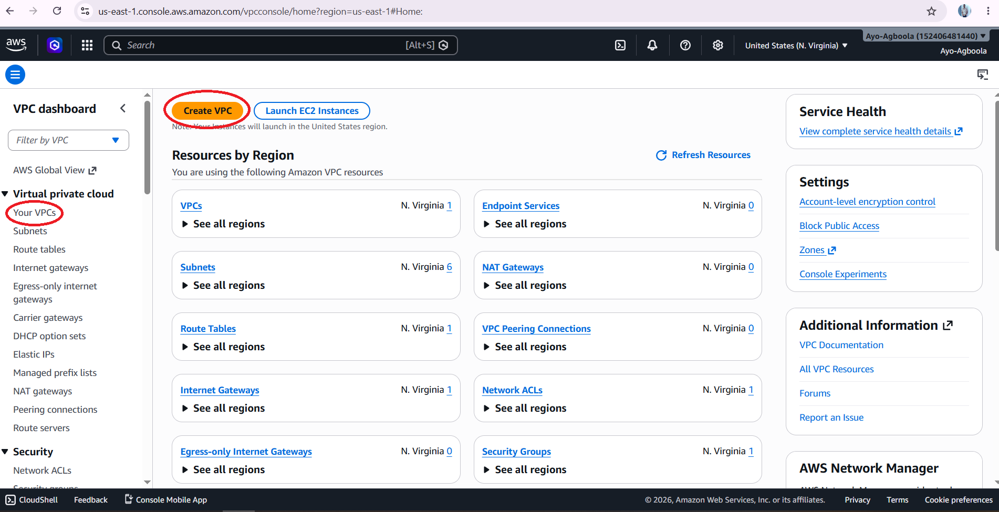
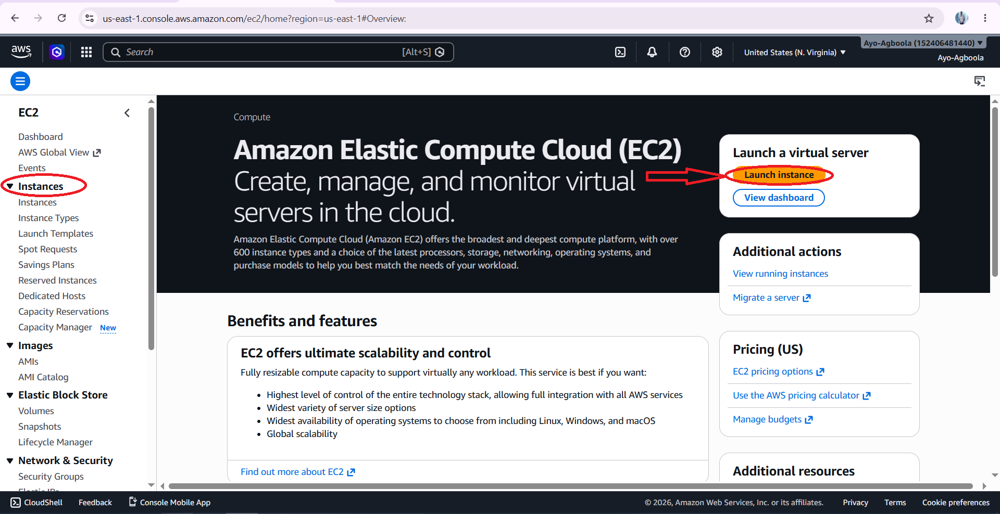
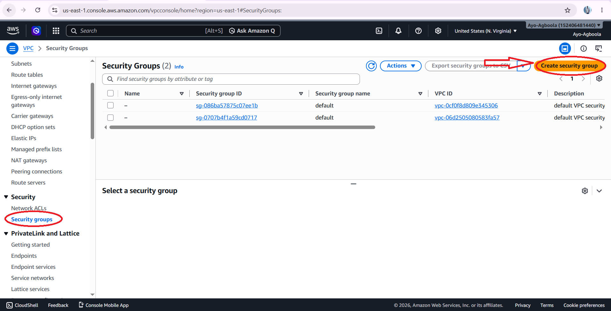
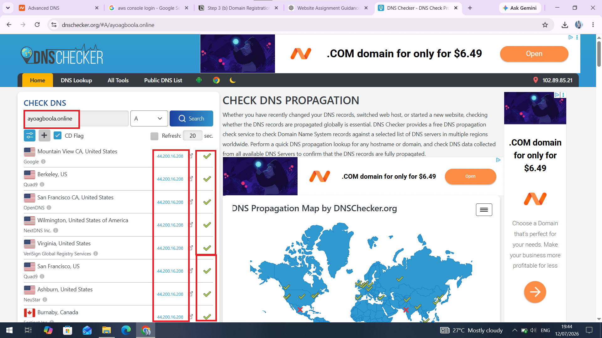
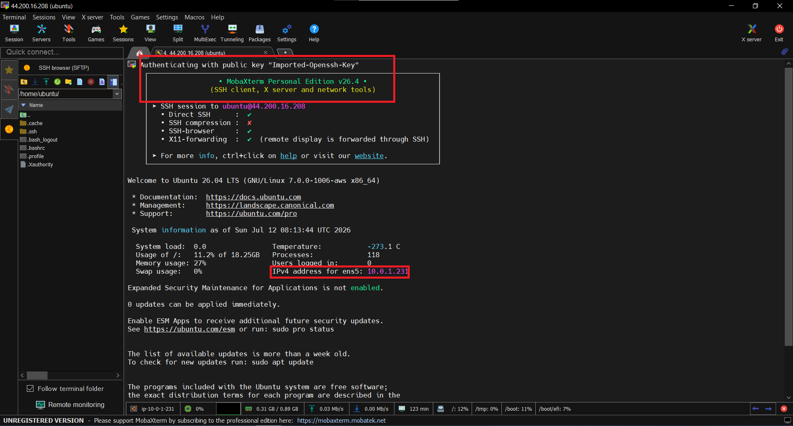
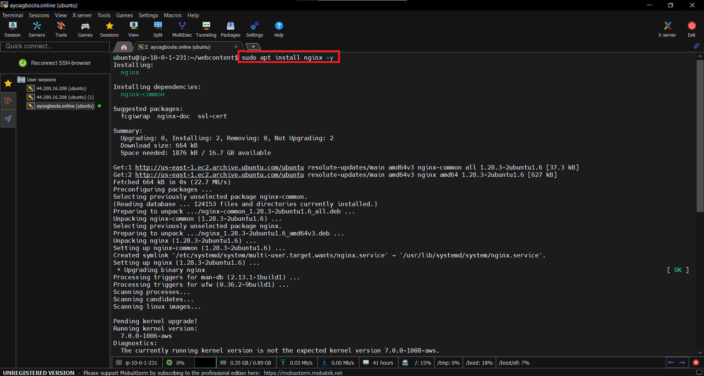
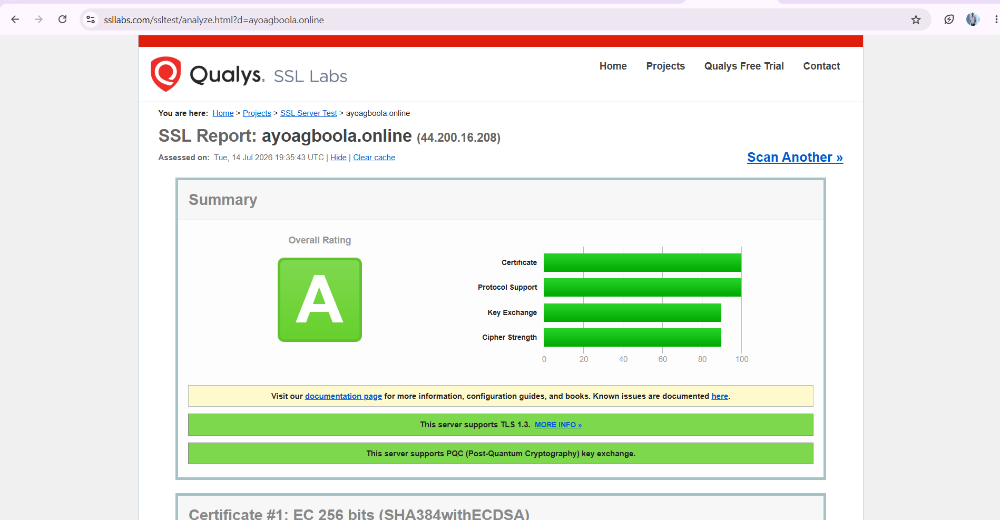
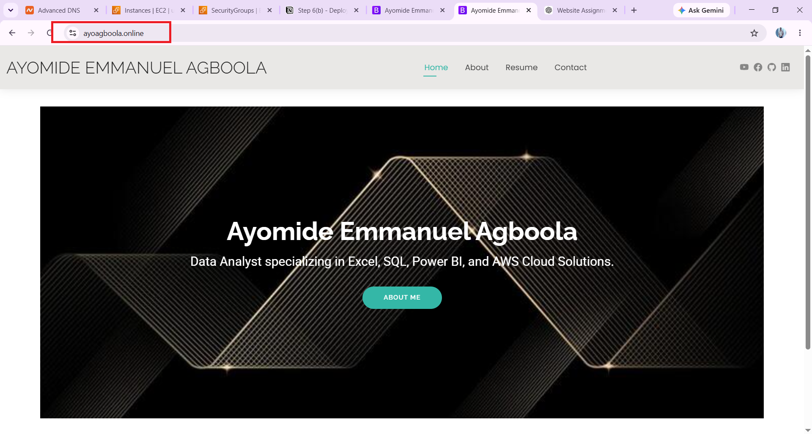
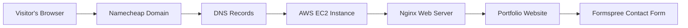

# Portfolio Website Hosted on AWS

## Project Overview

This project demonstrates how I built, deployed, and secured a static portfolio website using Amazon Web Services (AWS). The website was customized using HTML, CSS, and Bootstrap before being deployed to an Amazon EC2 instance running Ubuntu and Nginx. A custom domain registered with Namecheap was connected to the server using DNS, while HTTPS was enabled using Let's Encrypt and Certbot. To make the contact page functional without building a backend, Formspree was integrated to receive messages directly through email.

This project showcases practical experience in cloud infrastructure, Linux server administration, web server configuration, domain management, DNS configuration, SSL/TLS implementation, and static website deployment.

## Live Demo

🌐 **Website:** https://ayoagboola.online

🎥 **Video Walkthrough:**  
Watch the complete step-by-step deployment of this project on LinkedIn:

https://www.linkedin.com/posts/ayomide-e-agboola_a-few-days-ago-i-shared-screenshots-of-how-activity-7484139061641818112-nU57

## Technologies Used

- HTML5
- CSS3
- Bootstrap
- Visual Studio Code
- Amazon Web Services (AWS)
- Amazon EC2
- Ubuntu Server
- Nginx
- Namecheap
- DNS
- Let's Encrypt
- Certbot
- Formspree
- MobaXterm

## Project Workflow

1. Created an AWS account and accessed the AWS Management Console.
2. Configured the networking environment by creating a VPC, subnet, Internet Gateway, and Route Table.
3. Created and configured an Amazon EC2 instance running Ubuntu.
4. Configured the Security Group to allow SSH, HTTP, and HTTPS traffic.
5. Registered a custom domain with Namecheap.
6. Customized a portfolio website template using HTML, CSS, and Bootstrap in Visual Studio Code.
7. Connected to the EC2 instance using MobaXterm over SSH.
8. Uploaded the website files to the EC2 instance.
9. Installed and configured Nginx as the web server.
10. Deployed the website by copying the project files to the Nginx web root directory.
11. Connected the custom domain to the EC2 public IP address using DNS A records.
12. Verified DNS propagation using DNS Checker.
13. Installed Certbot and generated an SSL/TLS certificate from Let's Encrypt.
14. Configured HTTPS to secure the website.
15. Integrated Formspree to enable the contact form without building a backend.
16. Tested the website to ensure it was publicly accessible and functioning correctly over HTTPS.

## Key Features

- Custom portfolio website hosted on AWS.
- Accessible through a custom domain.
- Secure HTTPS connection using Let's Encrypt SSL/TLS.
- Responsive design for desktop and mobile devices.
- Contact form integrated with Formspree.
- Hosted on an Ubuntu EC2 instance using Nginx.
- Publicly accessible over the internet.
- Easy deployment and update process.

  
## Project Structure

```
portfolio-website-hosted-on-aws/
├── Image
├── Website source code
├── README.md
├── LICENSE
└── .gitignore
```

## Project Screenshots

### Step 1: AWS VPC Configuration
Configured a Virtual Private Cloud (VPC) to provide a secure networking environment for the EC2 instance.



### Step 2: Amazon EC2 Instance
Launched and configured an Ubuntu-based Amazon EC2 instance to host the portfolio website.



### Step 3: Security Group Configuration
Configured inbound rules to allow SSH, HTTP, and HTTPS traffic to the EC2 instance.



### Step 4: DNS Configuration
Connected the custom Namecheap domain to the EC2 public IP address using DNS A records.



### Step 5: Remote Server Access
Connected securely to the EC2 instance using MobaXterm over SSH.



### Step 6: Nginx Web Server
Installed and configured Nginx to serve the portfolio website.



### Step 7: SSL/TLS Configuration
Secured the website with a free SSL/TLS certificate from Let's Encrypt using Certbot.



### Step 8: Live Portfolio Website
The completed portfolio website deployed on AWS and accessible through a custom domain over HTTPS.



## Project Architecture



## Deployment Guide

To deploy this project, follow these steps:

1. Launch an Ubuntu EC2 instance on AWS.
2. Configure the Security Group to allow SSH (22), HTTP (80), and HTTPS (443).
3. Connect to the EC2 instance using SSH through MobaXterm.
4. Install and configure Nginx as the web server.
5. Upload the website files to the Nginx web root directory.
6. Register a custom domain with Namecheap and configure the DNS A record to point to the EC2 public IP address.
7. Install Certbot and generate an SSL/TLS certificate from Let's Encrypt.
8. Configure HTTPS for secure communication.
9. Integrate Formspree to enable the contact form.
10. Verify that the website is publicly accessible over HTTPS.

## Challenges Encountered

During this project, I encountered several challenges that strengthened my understanding of AWS and website deployment:

- Understanding how AWS networking components such as VPCs, subnets, Internet Gateways, and Route Tables work together.
- Configuring Security Group inbound rules correctly to allow SSH, HTTP, and HTTPS traffic.
- Connecting a custom Namecheap domain to the EC2 instance through DNS records and waiting for DNS propagation.
- Configuring Nginx to correctly serve the website files.
- Installing and configuring Let's Encrypt SSL/TLS certificates using Certbot.
- Integrating Formspree to make the contact form functional without developing a backend.
- Troubleshooting file locations, permissions, and deployment issues while updating the website.

## Lessons Learned

This project provided practical experience beyond building a static website. It improved my understanding of:

- AWS cloud infrastructure and networking.
- Linux server administration using Ubuntu.
- Deploying static websites with Nginx.
- Domain registration and DNS configuration.
- SSL/TLS implementation with Let's Encrypt and Certbot.
- Remote server management using SSH through MobaXterm.
- Integrating third-party services such as Formspree.
- Troubleshooting real deployment issues in a cloud environment.
